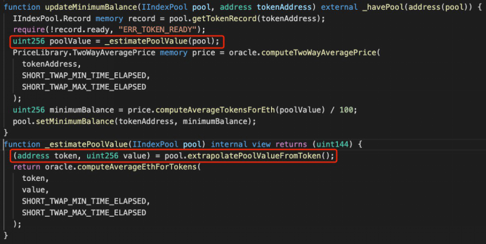
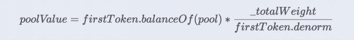

# Impossible Finance（2021.10.5）

### 报道

2021年10月15日，Blocksec发现了可疑的闪贷交易，经过分析，这是一次针对Indexed Finance的价格操作攻击。并获取了1600万美元的利润。

### 攻击原理

漏洞代码属于MarketCapSqrtController的updateMinimumBalance函数。

如上图所示，updateMinimumBalance 可以将 ready 为 false 的令牌的 minimumBalance 更改为 poolValue 的 1/100。 poolValue 的计算是漏洞的关键。PoolValue的计算公式如下：

这个公式存在着问题，即用一个代币来估计整个矿池的价值。\_totalWeight和token.denorm分别为矿池和代币的权重，它们不受流动性变化的影响，而是受外部市场的市场容量影响。而且它们的变化会受到时间段的限制，也就是每小时增加或减少1%。因此攻击者可以利用闪电贷操纵poolValue，瞬时对token的流动性造成较大变化，而pool和token的权重相应保持不变，这样做既就可以操纵token的minimumBalance来发起价格攻击。
