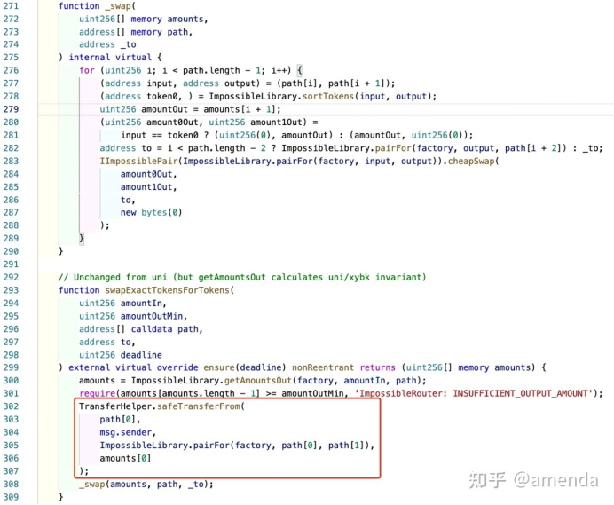

# Impossible Finance（2021.6.21）

### 报道

2021年6月21日，Impossible Finance (BSC) 项目遭受攻击。这次攻击中untrusted external invocation（不可信的外部调用） 是问题的关键所在。

### 攻击原理

Impossible Finance为了节省用户的交易费，在Uniswap V2的基础上做了一些优化。在Pair合约中，它实现了两个交易接口：swap 和 cheapSwap，用于维护一对token的交换。Swap与别的项目的swap功能大致相同，而cheapSwap与swap的逻辑几乎相同，但是缺少了校验，缺少这一步校验的swap相当于“白给”（只要有人调用，指定amount0Out，amount1Out和to，Pair就会无条件把对应数量的token0和token1转给地址to）。为了安全，cheapSwap函数有一个额外的modifier：onlyIFRouter，这个modifier决定了cheapSwap只能被其Router合约调用。Router的代码如下：

函数swapExactTokensForTokens是IF提供给用户的高层接口，它提供五个参数。 可以看出Router帮助用户完成了Pair的定位（第305行），以及amounts的计算（第300行）；相比于直接使用Pair中的swap接口，使用Router做交换更加方便。

但是Router的代码存在漏洞。如图四所示，第300行依赖Pairs的余额计算出了amounts，在283行调用cheapSwap使用了amounts做交换，而两者之间有一个untrusted external invocation（不可信的外部调用）：第302行 \~ 第307行。攻击者可以利用这个untrusted external invocation将amounts变为obsolete value（陈旧值），导致亏损。

攻击过程简要来说就是攻击者可以创建一个用于攻击的fake token。例如AAA token，由于没有AAA/IF的Pair合约，Router便调用Impossible Factory的createPair为它们创建了一个Pair。在攻击阶段，恶意合约调用Router的swapExactTokensForTokens接口发起攻击，当Router调用fake token: AAA 的transferFrom时，控制流就会转到攻击者一方（因为AAA的transferFrom是攻击者写的），即：恶意合约在amounts被计算好了之后（第300行），利用untrusted external invocation调用了 Pair（IF/BUSD）的swap 接口，将IF 换成了BUSD，这一笔交换是正常的。此时控制流回到了Router的第308行，如果Router在此时重新计算一次amounts会发现，此时的amounts的值已经变了，不幸的是，Router并没有做这件事，它使用的是 the obsolete value （陈旧的amounts），这导致了Router调用fake token: AAA 的transferFrom， IF再一次换出了BUSD。
