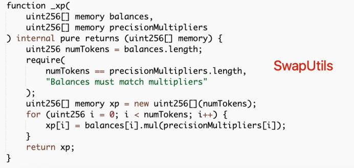
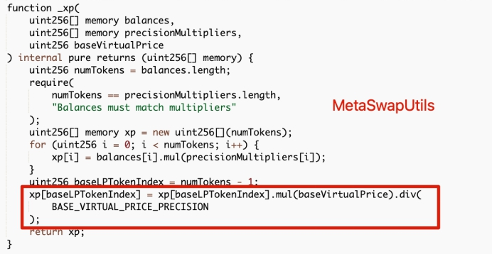

# Nerve Bridge（2021.11.5）

### 报道

2021年11月5日，Blocksec发现了一次针对Nerve Bridge的攻击，包括fUSDT和UST的MetaPools。截止11月18日，攻击者已经耗尽了Nerve的 staking pool的流动性，并获得了900 BNB的利润。并且漏洞代码是从 Saddle.Finance 分叉出来的，这已经导致 Synapse Bridge 在 2021 年 11 月 6 日损失了 800 万美元。

### 攻击原理

在MetaPool中有两个重要功能，即swap和swapUnderlying。具体来说，前者用于交换LP代币和矿池稳定币，后者用于交换矿池稳定币和底层稳定币。

对于此次事件的受害者 MetaSwap 合约，这两个功能是在两个不同的库中实现的：SwapUtils 合约中的 swap 函数和MetaSwapUtils 合约中的 swapUnderlying。

为了将底层稳定币换成池稳定币，swapUnderlying 函数将使用用户提供的代币为底层池增加流动性以获得 LP 代币。之后，就变成了LP代币和矿池稳定币的互换，即swap函数的功能。这样对应的密钥交换参数应该保持一致。其中一个参数是 xp，它用于在执行交换时对令牌值进行标准化。归一化的结果将用于进行进一步的计算。但是在这两个函数中的xp实现不一致：

上面两图展示了不一致，红色框中的代码通过测量LP代币的virtual price来调整LP代币的价值。然而swap函数忽略了virtual price的影响，这意味着LP代币的价值将被低估。也就是说可以换出更多的LP代币。因此可以先用相应的LP代币换取底层稳定币的流动性，然后通过调用swapUnderlying函数交换矿池稳定币，从而收获更多的矿池稳定币。
