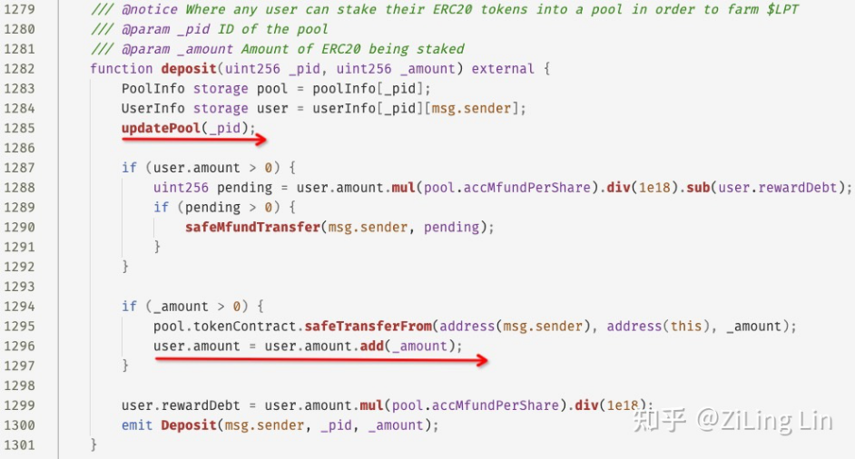
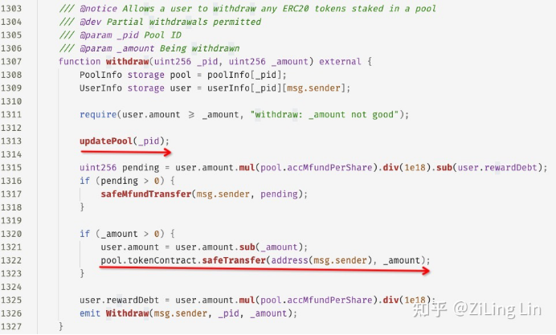

# Sanshu Inu（2021.7.11）

### 报道

2021 年 07 月 21 日 03:40，Blocksec的攻击检测系统检测到某个交易异常。通过对该交易进行扩展分析，发现这是一起利用通缩代币（deflation token） KEANU 的机制对 Sanshu Inu 部署的 Memestake 合约的奖励计算机制的漏洞进行攻击的事件，攻击者最后获利 ETH 约 56 个。

### 攻击原理

与此次攻击有关的有两个实体合约：KEANU代币的Keanulnu合约和Memestake合约。KeanuInu 在实现代币 KEANU 的转账时，会扣取一定比例的币用于销毁和再分配，其中用于销毁的比例设置为定值—2%。

上图是 MemeStake 的 deposit 函数。函数首先调用 updatePool 更新资金池状态，然后将用户的 token 转账给自己。当传入的\_amount 大于 0 时会在代码的 1295 行进行转账。

然而，由于 KEANU token 的通缩特性，虽然调用 safeTransferFrom 函数时传入的金额是\_amount，但是实际上转入资金池的金额小于\_amount。并且对于 MemeStake 来说，所有用户的某个币种（如 KEANU token）的存款都属于 MemeStake。

在转账后的 1296 行，MemeStake 会对用户的存款进行登记，但这里登记采用的仍然是\_amount （而真实的转账量小于\_amount），因此用户真正的存款量比登记的 user.amount 更小。

最后在 1299 行，可以看出 user.rewardDebt 参数也是根据（比真实值要大的） user.amount 来计算的。

上图是 MemeStake 的 withdraw 函数。该函数首先会检查 user.amount 是否还有足够的余额，但由于 user.amount 本身比真实值大，因此这里的检查是不准确的。接下来，同样会调用 updatePool 函数更新资金池状态。

在 1321 行，withdraw 函数会先扣除在 user.amount 中登记的余额，然后调用 transfer 函数把 token 转回用户。和 deposit 函数一样，这里的逻辑同样存在问题，由于每次转账都会造成通缩，因此转给用户的数量会小于实际的转账量。

上图是MemeStake 的 updatePool 函数。首先从 1255 行可以看出，每次调用会记录上一次更新的 blockNumber，如果此次调用的区块和上次更新时相同，则会直接返回，也就是说updatePool 对每个区块只会更新一次资金池状态。

接下来在 1259 行，会获取 MemeStake 自身在 token 合约中的余额（上文提到，每次用户 deposit 都会将 token 转给 MemeStake）。最后在 1275 行，会利用这个余额作为分母，计算该资金池每一次 deposit 和 withdraw 的奖励（也就是 pool.accMfundPerShare 参数）。

总结来说，在此攻击中，首先，在一个交易内，通过反复调用 deposit 和 withdraw 函数，榨干 MemeStake 的资金池。这个操作利用了三个代码问题：

1\) 首先，user.amount 的记账比真实值多，因此每次 withdraw 都可以成功。

2\) 第二，MemeStake 中所有用户的资金都在一个池子中，因此每一笔转账实际上 Burn 掉的是池子中其他用户存入的 KEANU token。

3\) 第三，由于 updatePool 在同一个块中不会进行状态更新，因此不会影响 pool.accMfundPerShare 参数，也不会产生 Mfund token 的 reward。

接下来，在下一个区块时，直接调用 withdraw 函数。通过对 updatePool 函数的分析可知，此时会产生池子状态的更新，且由于前一步操作榨干了 MemeStake 的资金池，token.balanceOf(MemeStake) 极低，产生了巨大的 pool.accMfundPerShare。随后在 withdraw 函数的第 1315 行，计算出的 Mfund reward 量非常大，导致巨额的 Mfund 回报。
