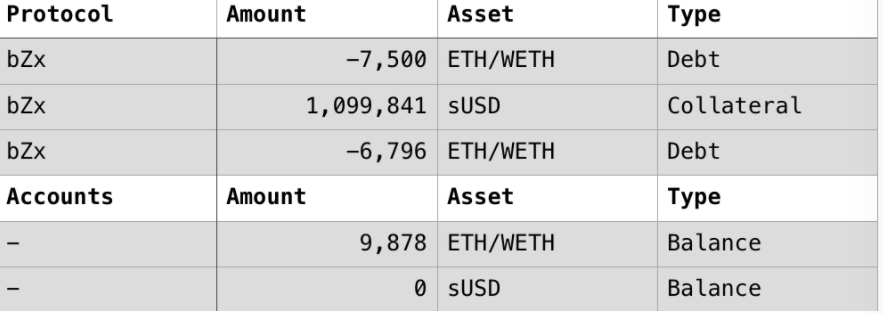

# 2.bZX

### 报道



### 攻击步骤

1、闪贷获取可用资产。通过bZx 合约的flashBorrowToken() 接口，借出 7,500 ETH，并指定攻击者的合约为资产接收方地址；

2、抬高sUSD代币的汇率。攻击者分两批共 900 ETH通过 KyberNetwork DEX 换取成 sUSD，共换取了 156,003 枚 sUSD，使得 sUSD 价格被抬高了 1.5 倍；

攻击点：KybrNetwork 内部通过 Uniswap 完成 sUSD 与 ETH 转换，这使得那些将 Uniswap 作为 sUSD/ETH Oracle 的其它平台（比如说 bZx）误认为当前 sUSD 价格的确有这么高

3、抵押sUSD代币；

4、偿还闪电贷贷款，获取了 2,378 ETH ；

### 细节

攻击者用4418个ETH换取了1099841枚sUSD，导致此平台认为sUSD价格涨高

.png>)

攻击者将手里拥有的 1,099,841 枚 sUSD 通过 bZx 的borrowTokenFromDeposit() 接口全部抵押到 bZx 合约之中，按照 sUSD/ETH 正常价格的话，bZx 应当借给攻击者 3,928 ETH，但是 bZx 从 Oracle Kyber 这边获取的价格偏高，使得借出了 6,796 枚 ETH，多借了 2,868 ETH。加上之前剩余的ETH，攻击者目前拥有9878枚ETH,偿还步骤一的闪电贷款，攻击者在此次攻击中获取了2378枚ETH。

### 总结

此次攻击是由于sUSD被单方面的市场操控，从而引起价格波动，bzx并没有对此代币的价格波动进行更多的验证，并没有出现不一致。
