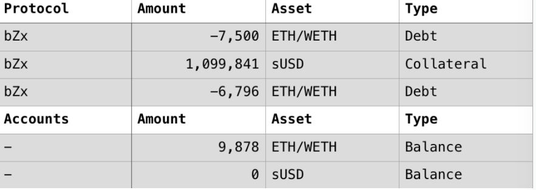

# Bearn.Fi（2021.5.16）

### 分析



### 攻击原因

代码传参漏洞，传递参失误导致资产取出了同等数量更高价值的其他代币，攻击者利用这个漏洞不断存取资产来套利。

### 攻击流程

1. 攻击者先从Cream借出大量的BUSD(约7百万)。
2. 由于withdraw的问题，攻击者反复使用deposit和withdraw 得到更多的资产，并耗尽资金池。
3. 在最后攻击者得到了约8百万的 BUSD，将7百万的BUSD归还闪电贷。
4. 将剩余的BUSD卖出获利。

### 细节

由于withdraw（）中传参错误，导致了代码漏洞进而被攻击者使用。

BvaultsBank中的withdraw（）传入是BUSD的值，而在后面提取ibBUSD时，本应传ibBUSD的值，却依然传的是BUSD的值，直接导致提取出了更多的ibBUSD。

.png>)

因此攻击者withdraw的是BUSD，withdraw出来的却是同等数量的ibBUSD。由于同等IbBUSD价值高于BUSD，因此攻击者从该漏洞实现了套利。
