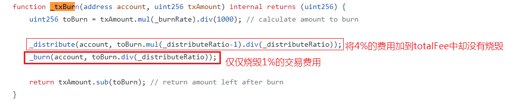

# Bogged Finance（2021.5.22）

### 分析



### 攻击原因

交易费逻辑漏洞，每笔交易仅扣除1%交易费，却分发了4%交易费作为分红给LPs。攻击者可通过此漏洞流动性挖矿套利。

### 攻击流程

1. 攻击者在 PancakeSwap 中分 11 笔，总计Swap出47770个BOG。
2. 分 9 笔将共计 88,159.43 WBNB 和 421,761.33 BOG 在 PancakeSwap 中为WBNB/BOG 交易对添加流动性并获得对应的 83,440.57 LP Token。
3. 攻击者操作了 400多笔自我转账，共计转账 187.4万 BOG，并获的 15.1 万 BOG的流动性奖励。
4. 攻击者将赃款兑换为 WBNB，并通过 Nerve分批次转换为以太坊上的 ETH。
5. 烧毁增加的流动性，完成资产转移。

### 细节

典型地通过代码漏洞实现的套利攻击。攻击者利用transferFrom函数中调用的\_txBurn 函数的逻辑漏洞进行攻击。

漏洞合约（BOG-Token）源码：[https://github.com/HysMagus/bsc-contract-sanctuary/blob/22c38c255890bcaad7853195f8caaa3611e8eb3a/0xE09151c826307434861FcFeb1bEaFeD6c2Bc1F23/contract.sol](https://github.com/HysMagus/bsc-contract-sanctuary/blob/22c38c255890bcaad7853195f8caaa3611e8eb3a/0xE09151c826307434861FcFeb1bEaFeD6c2Bc1F23/contract.sol)

设计者设计BOG-Token转账中有5%作为交易费用，1%需要烧毁，4%按照比例分给流动性提供者(LPs)：

.png>)

然而在\_transferFrom函数逻辑中，先将总交易额在\_txBurn中扣除5%剩下95%作为sendAmt,再将sendAmt进行转账。

.png>)

漏洞就在在\_txBurn函数中。sender实际上只烧毁（扣除）了1%的费用，剩下4%还在sender的账户中，并没有扣除：

.png>)

并且在\_distribute函数中，仍将4%的交易费加到分红的总交易费用\_\_totalFees\_中：

.png>)

因此产生了每笔交易仅仅扣除了1%的费用，所有流动性提供者却能获得4%费用的漏洞。

攻击者给WBNB/BOG池添加大量流动性以作为LP获得高比例分红，接着通过多次自我转账，利用该漏洞作为LP获得了高于其转账扣除交易费用的分红，从而实现套利。
