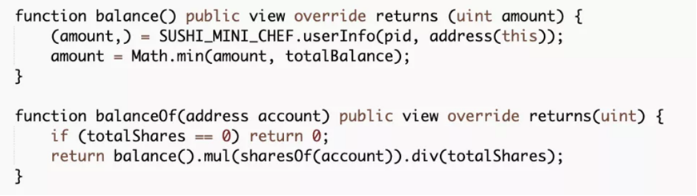

# PancakeBunny（2021.7.17）

### 分析



### 攻击原因

VaultSushiFlipToFlip 合约获取在 MiniChefV2 中抵押的抵押品数量时，错误地获取了攻击者未通过 VaultSushiFlipToFlip 抵押的抵押品数量，导致参数铸币的参数异常。最终铸造出额外的 polyBUNNY 代币。

### 攻击细节

1\. 攻击者闪电贷代币，存入uniswap获取流动性凭证LP

2\. 小部分LP存入VaultSushiFlipToFlip ，大部分存入MiniChefV2 ，并将收益地址指定为VaultSushiFlipToFlip

3\. 调用VaultSushiFlipToFlip 合约的 withdrawAll 函数，其中的profit是由balance 函数获取 VaultSushiFlipToFlip 合约在 MiniChefV2 中抵押的 SLP 数量与用户持有的凭证占比相乘得到 amount 的。

4\. 但用户有大量抵押代币直接抵押在MiniChefV2中而绕过了

导致amount大于预期值，计算得到一个巨大的performanceFee

5\. 调用mintForV2 函数中参与铸造 polyBUNNY 代币奖励

6\. 函数中价格由预言机获取不可更改，但数量performanceFee作为参数传入，导致计算出的 valueInETH 与 valueInUSD出现非预期的巨大值。

7\. 攻击者获取大量的铸币奖励
