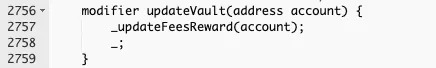
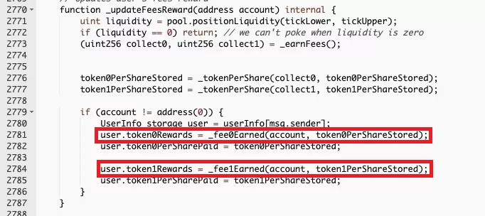
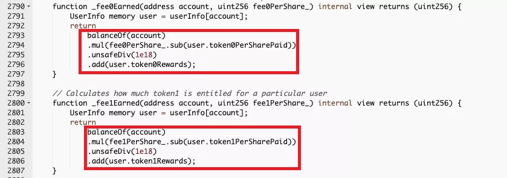

# Popsicle（2021.8.4）

### 分析



### 攻击原因

Popsicle中的Sorbetto Fragola产品遭到攻击。该产品的LP凭证（Popsicle LP ，LP）持有者可以将PLP任意转移给其他用户，并且转移过程中没有奖励结算转移的操作，因此只要持有 PLP 凭证就可以立即获取奖励。最终造成同个 PLP 凭证却能在同个时间节点给多个持有者带来收益。

### 攻击流程

1. 攻击者创建多个攻击合约，并从 AAVE 中利用闪电贷借出大量的代币。
2. 攻击者使用借来的代币存入 Sorbetto Fragola 合约中获得 PLP 凭证。
3. 攻击者利用 Sorbetto Fragola 合约的奖励结算缺陷问题将获得的 PLP 凭证在其创建的攻击合约之间进行转移并分别调用了 Sorbetto Fragola 合约的 collectFees 函数来为各个攻击合约纪录奖励。
4. 攻击者燃烧 PLP 凭证取回在 Sorbetto Fragola 合约中存入的流动性资金，并通过各个攻击合约调用 Sorbetto Fragola 合约的 collectFees 函数来获取纪录的奖励。
5. 不断的循环上述操作攻击各个流动性资金池获取奖励。
6. 归还闪电贷。

### 攻击细节

Sorbetto Fragola 产品主要是用于帮助用户管理 Uniswap V3 头寸，以避免用户在 Uniswap V3 做市的头寸超出所选定的价格范围。用户可以在 Sorbetto Fragola 中存入提供流动性对应的两种代币，Sorbetto Fragola 会给到用户 Popsicle LP (PLP) 凭证，用户使用此凭证可以获取奖励并取回抵押的流动性资金，同时此凭证也是可以随意转移给其他用户的。

攻击者利用合约中用以更新奖励的updateVault 修饰器进行攻击。

该修饰器调用了更新费用结算的函数updateFeeReward()，该函数根据当前用户PLP持有量结算流动性池子中两种token分别对应的新增奖励收益（ \_fee0Earned()及 \_fee1Earned()计算出）并加到之前的收益(user.token0Rards 及）上。

攻击者主要用到deposit()存入代币，以及collectFees()获取奖励。两个函数均带有带有updateVault()修饰器。

以攻击者一次三合约攻击为例，共有三个合约C1,C2,C3。攻击者在C1调用deposit（）存入代币获得PLP之后，将PLP转移给C2，C2调用collectFees()获取奖励，之后转给C3如法炮制，最终转回C1，并withdraw出代币。这样攻击者不仅拿回了存入的流动性还额外获得了两份流动性提供的奖励。
